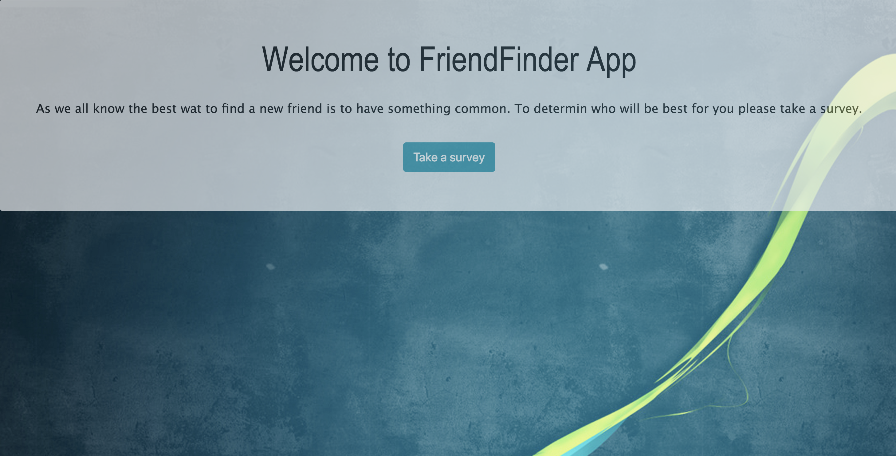
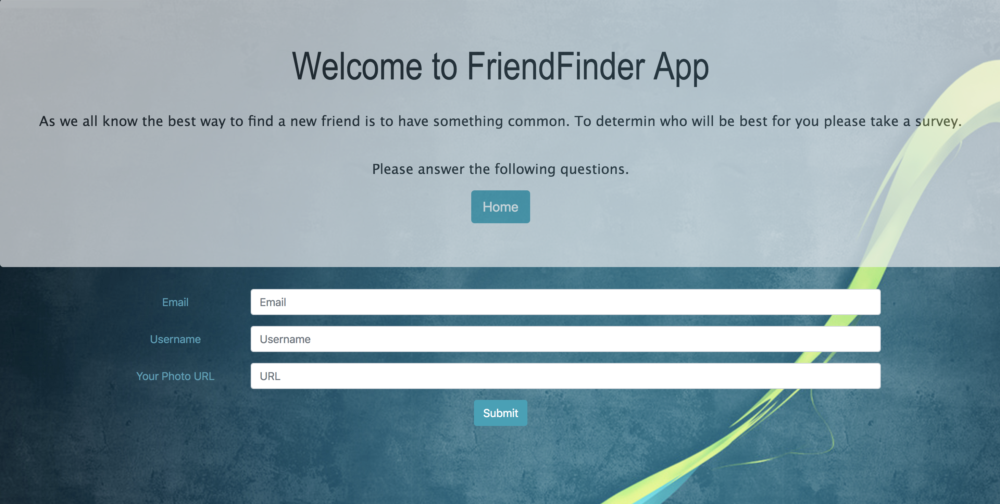
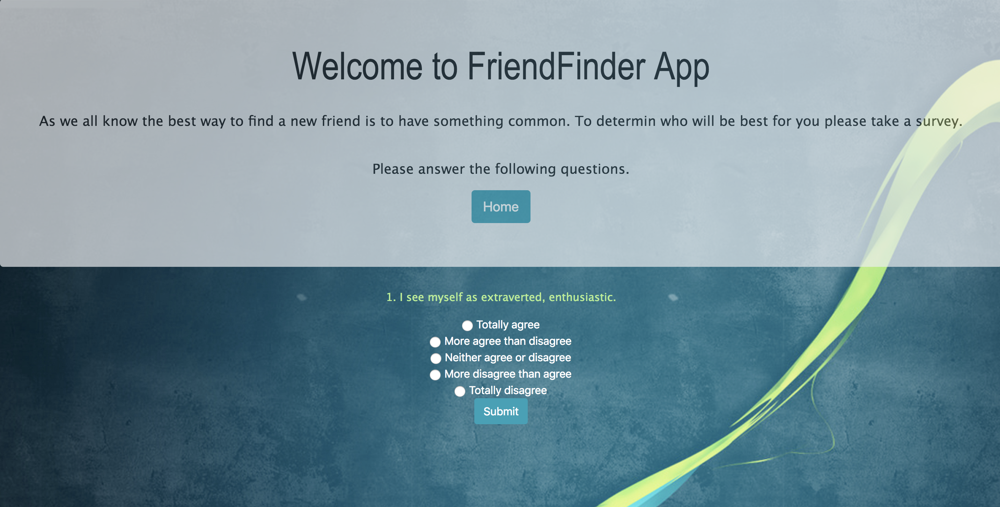

# FriendFinder

This is a compatibility-based application that takes the results of the user's survey, then compare their answers with those from other users. The app displays the name and picture of the user with the best overall match. 

## Link to test the app
https://mysterious-beach-16397.herokuapp.com/survey

## Screenshots

______________________________________________________________________________________________________________________________

______________________________________________________________________________________________________________________________

______________________________________________________________________________________________________________________________

______________________________________________________________________________________________________________________________

## Technologies used

- Node.js
- express NPM Package - https://www.npmjs.com/package/express
- path NPM Package - https://www.npmjs.com/package/path
- body-paraser NPM Package - https://www.npmjs.com/package/body-parser
